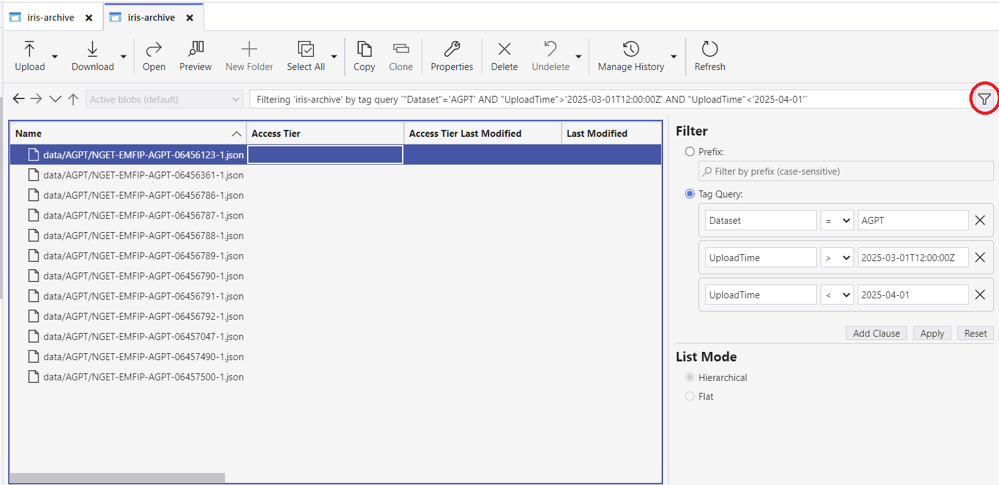

# IRIS Archive

## Overview
All files sent out across IRIS will additionally be stored within the IRIS Archive. The archive requires no authentication allowing quick data retrieval.

The archive implements caching of files accessed within the past year and file compression to again speed up the service.

## IRIS Archive Structure 

All files are stored within a folder called `data`.

Inside this we see a folder for each dataset, for example `ABUC`.

## Azure Storage Explorer

To easily browse the IRIS Archive with a graphical interface, Azure Storage Explorer can be used.

### Setup

1. Download and install Azure Storage Explorer from [here](https://azure.microsoft.com/en-gb/features/storage-explorer/).
2. Open Azure Storage Explorer and select the plug symbol in the left hand menu.
3. Select `Blob container or directory`.
4. Select `Anonymous access`.
5. Enter the following blob container URL: `https://archive.data.elexon.co.uk/iris-archive`.
6. Confirm connecting to resource.

### Cached files

For each dataset Azure Storage Explorer caches 5000 files, and only shows these by default. To load additional files the `Load more` button must be pressed.

### Troubleshooting

If you are having difficulties downloading files please ensure you have Azure Storage Explorer [v1.33](https://github.com/microsoft/AzureStorageExplorer/releases/tag/v1.33.0) or later as previous versions will block downloads by default.

## Tag filtering

IRIS Archive blobs have 3 tags to filter by:
 - Dataset - The acronym for the dataset name (e.g. AGPT)
 - Timestamp - Reference time for the blob's data content
 - UploadTime - The time when the blob was uploaded to IRIS

More information about dataset acronyms and reference timestamp fields can be found [here](dataset_and_timestamp_reference.md).

The format for datetime tags is `YYYY-MM-DDTHH:mm:ssZ`.

All tags are case sensitive.

### Azure Storage Explorer Tag Filtering

In Azure Storage Explorer, you can click on the filter button (marked with red in the example image), select 'Tag Query' and use the tags to retrieve desired blobs



### Azure API Tag Filtering

You can use the Azure Storage Blob API to request blobs using tag filters.

`https://archive.data.elexon.co.uk/iris-archive?comp=blobs&restype=container&where=<expression>`

### Expression Syntax

| Operator | Description | Example |
|----------|-------------|---------|
| = | Equal | `where="Dataset" = 'AGPT'` |
| > | Greater than | `where="Timestamp" > '2023-06-18T10:51:26Z'` |
| >= | Greater than or equal | `where="UploadTime" >= '2023-06-18T00:00:00Z'` |
| < | Less than | `where="Timestamp" < '2023-06-20T00:00:00Z'` |
| <= | Less than or equal | `where="UploadTime" <= '2023-06-19T23:59:59Z'` |
| AND | Logical and | `where="Dataset" = 'AGPT' AND "Timestamp" > '2023-06-18T00:00:00Z' AND "Timestamp" < '2023-06-20T00:00:00Z'` |

Expressions should be URI encoded. See [Microsoft documentation](https://learn.microsoft.com/en-us/azure/storage/blobs/storage-manage-find-blobs?tabs=azure-portal#finding-data-using-blob-index-tags) for more information.

### Example

To search for blobs uploaded to IRIS on 14th April 2025 for the BOAV dataset:

Expression: `"Dataset" = 'BOAV' AND "UploadTime" > '2025-04-14' AND "UploadTime" < '2025-04-15'`.

URL encoded: `%22Dataset%22%20%3D%20%27BOAV%27%20AND%20%22UploadTime%22%20%3E%20%272025-04-14%27%20AND%20%22UploadTime%22%20%3C%20%272025-04-15%27`

Full request: `https://archive.data.elexon.co.uk/iris-archive?comp=blobs&restype=container&where=%22Dataset%22%20%3D%20%27BOAV%27%20AND%20%22UploadTime%22%20%3E%20%272025-04-14%27%20AND%20%22UploadTime%22%20%3C%20%272025-04-15%27`

## Azure SDKs

The IRIS Archive can also be interacted with programmatically via Azure SDKs. 

See more information at the following links:
- [Introduction to Azure Blob Storage](https://learn.microsoft.com/en-us/azure/storage/blobs/storage-blobs-introduction).
- [SDK downloads and documentation](https://azure.microsoft.com/en-gb/downloads/).


### Example code

See below code to retrieve a file using the Python SDK.

```python
import asyncio

from azure.storage.blob.aio import StorageStreamDownloader, BlobServiceClient

IRIS_ARCHIVE_URL = "https://archive.data.elexon.co.uk/"
BLOB_PATH = "data/ABUC/ABUC_202311140741_NGET-EMFIP-ABUC-00689167-1.json"
CONTAINER_NAME = "iris-archive"

def range_request_hook(request):
    range_value = request.http_request.headers.pop('x-ms-range', None)
    if range_value:
        request.http_request.headers['Range'] = range_value


async def download_blob():
    async with BlobServiceClient(IRIS_ARCHIVE_URL, raw_request_hook=range_request_hook) as blob_service_client:
        async with blob_service_client.get_blob_client(CONTAINER_NAME, BLOB_PATH) as blob_client:
            blob_downloader: StorageStreamDownloader = await blob_client.download_blob(encoding="UTF-8")
            contents = await blob_downloader.readall()
            print(contents)


asyncio.set_event_loop_policy(asyncio.WindowsSelectorEventLoopPolicy())
asyncio.run(download_blob())
```

The `range_request_hook` function is needed as by default our IRIS archive requests use the standard HTTP range header whereas the SDK requires the `x-ms-range` header in all range requests.

To fix this we manually convert the header in our code to the desired type and pass this converted header to our `BlobServiceClient`.
