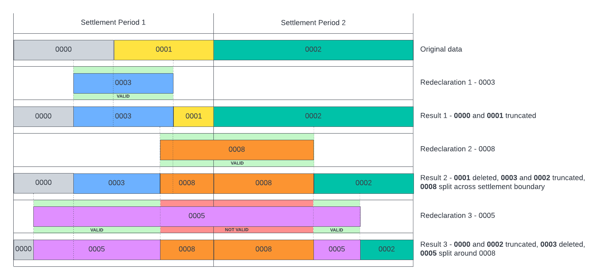
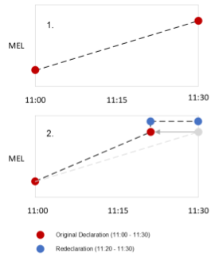

# Logic for Creating a Resolved Position for Maximum Export Limits

## Context

Maximum Export Limit (MEL) is a fundamental concept within the GB Balancing Mechanism where Balancing Mechanism Units (BMU) typically Generators submit a profile of their maximum Megawatt (MW) volumes over a defined period to National Grid ESO (NGESO). This usually takes place a day ahead and NGESO provides the MEL data for a specific Settlement Period (SP) to Elexon at Gate Closure, i.e. one hour prior to the start of a Settlement Period. Following Gate Closure, NGESO send a consolidated MEL data file which includes data for all BMU for that effective SP. BMUs are able to make changes to their MEL submissions on an adhoc basis and after they revise their profile, NGESO will send a re-declaration MEL file.

Note the logic described here also applies for Maximum import Limit (MIL).

The consolidated file contains submissions for multiple BMUs confined to one SP at Gate-Closure. A re-declaration file can span across multiple SPs including changes within or previous SPs.
Elexon’s Insights Solution or BMRS pieces together the individual re-declaration files to create a final or resolved position for that BMU, where applicable overwrites previous submissions. A resolved MEL position is a composite of the raw MEL data from multiple files to create a single MEL history for a BMU.

Requesting the data via the Insights APIs or website will return the current resolved position accounting for re-declaration if any were made at the time of the request, as per the endpoints below:

### Insights API
- `/datasets/MILS`
- `/datasets/MELS`
- `/physical`
- `/physical/all`

### Insights Website
- [https://bmrs.elexon.co.uk/balancing-mechanism-bmu-view](https://bmrs.elexon.co.uk/balancing-mechanism-bmu-view)
- [https://bmrs.elexon.co.uk/balancing-mechanism-market-view](https://bmrs.elexon.co.uk/balancing-mechanism-market-view)

IRIS will send raw data in real time as received i.e. either a consolidated file at Gate-Closure and subsequent re-declarations.

This guidance describes the logic for creating a resolved MEL position when re-declaration files have been received.

## Re-declaration Process

Re-declaration of a MEL profile has some characteristics which differs from the original Gate-closure submission:
- Normally specific to one BMU
- Can be a different time-series interval and resolution from previous submission
- No limit to the number of re-declarations
- Can be prospective and/or retrospective
- Not confined to one Settlement Period
- Could be received out of order or sequence in particular after an outage

When files are received out of order, then a few parameters within the source file can be used to work out the validity of the submission, before piecing it together to create the current position; the most recent file will be the one the latest Notification Sequence and Notification Time.

```
*MELS_202305240800_25465.bmr
*
*Maximum Export Limit Data
*
*Data,BMU Name,Time From,Level From,Time To,Level To,Notification Time,Notification Sequence
MELS,ABERU-1,2023-05-24 09:00,15,2023-05-24 09:30,15,2023-05-22 22:51:00,103276993
MELS,ABRBO-1,2023-05-24 09:00,11,2023-05-24 09:15,11,2023-05-24 07:24:23,103343831
MELS,ABRBO-1,2023-05-24 09:15,10,2023-05-24 09:30,10,2023-05-24 07:24:23,103337944
MELS,ABRTW-1,2023-05-24 09:00,36,2023-05-24 09:30,36,2023-04-03 10:00:22,103300106
MELS,ACHRW-1,2023-05-24 09:00,42,2023-05-24 09:30,42,2023-04-03 10:00:41,103300129
MELS,AFSE01,2023-05-24 09:00,0,2023-05-24 09:30,0,2023-04-03 10:00:37,103300127
MELS,AFTOW-1,2023-05-24 09:00,50,2023-05-24 09:30,50,2023-05-24 07:05:16,103300129
MELS,AG-ADL00B,2023-05-24 09:00,0,2023-05-24 09:30,0,2023-05-23 06:00:15,103300129
MELS,AG-ADL01M,2023-05-24 09:00,0,2023-05-24 09:30,0,2023-05-23 06:00:43,103300090
```

## Assessing Validity of a Re-declaration File

Prior to the system overwriting a previous submission, it needs to assess its validity (declared later than the data to be overwritten):
1. The notification sequence should be greater, or
2. The same notification sequence with a later notification time

## Merging, Truncating Records

As the files can be received in any order, the complexity will be to work out which part of the submission is valid. This is represented below using notification sequence 0000, 0001, 0002, etc.

Starting with original submission, an intra SP re-declaration with sequence 0003 with time series across SP1. As it is later sequence it will truncate data the time series end of sequence 0000 and beginning of 0001; shown as result 1 below.

Result 3 illustrates a more complex scenario with part of re-declaration 0005 not valid.



## Truncating Records (To/From Levels)

While truncating or piecing together records, **Levels From and To** should be preserved.

When processing a valid file, Levels From and To are copied directly from the source into the resolved position, regardless of the Times From and To values. If the file is only partially valid, Time From and/or Time To will be modified during the merge/truncate process described above. This may lead to a “squeezing”, “stretching” or perhaps duplication of a Level From and Level To pair if the new data does not match existing resolved declaration boundaries.

Similarly, if an existing resolved declaration is truncated by a valid redeclaration, the Time From or Time To values may be adjusted with no change to Level From and Level To.

Resolved records should never be merged unless their LevelFrom and LevelTo values match, in addition to other checks (e.g., BMU, Notification Sequence…).

The algorithm makes no attempt to interpolate between “Level/Time From” and “Level/Time To” when records are truncated or split. All Level values in the resolved view can be traced directly to a Level submitted to NG by the BMU, however the associated Time may have been adjusted as part of the merge/truncate process. This places the onus on the BMU to submit complete and unambiguous MIL declarations.

A simple illustration of this incomplete scenario is shown below. The diagram shows a single SP (11:00-11:30) covered by a single MEL declaration with distinct Level From and Level To values. A valid redeclaration file then arrives, covering part of the SP (11:20 – 11:30) but does not declare updated limits for 11:00-11:20. The Insights Solution will “roll-back” the original Level To value to 11:20 (where it was originally timed 11:30).



